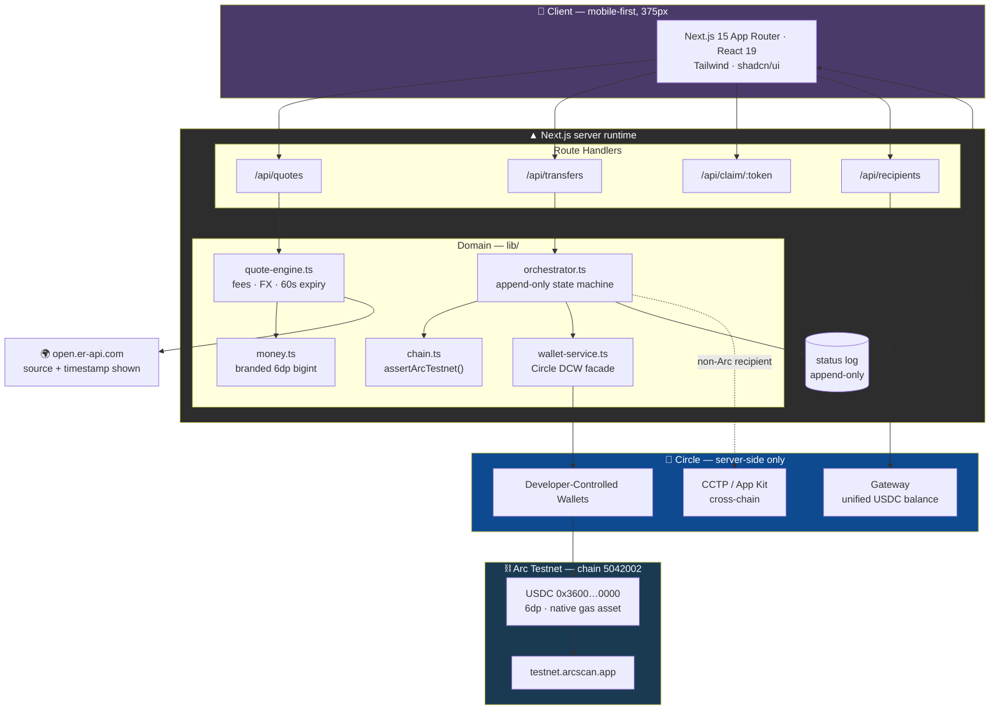
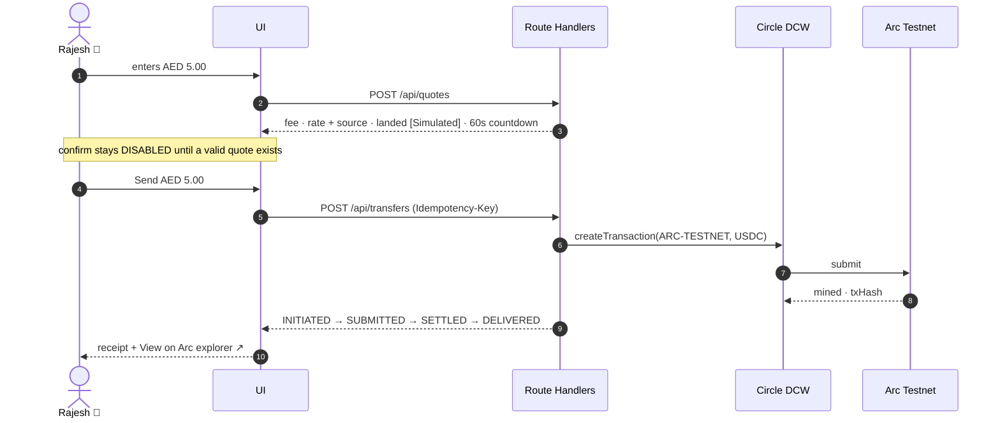

# Aurum Rails — UAE → Global Cross-Border Payments on Arc

**Ignyte × Circle × Arc — Stablecoins Commerce Stack Challenge**
**Track 1: Best Cross-Border Payments & Remittances Experience (UAE → Global)**

> ⚠️ **Arc Testnet only. Educational demo. No real funds.**

A transparent remittance experience for the UAE → Global corridor. Send money home
from Dubai, see **every** fee before you commit, and watch it settle on Arc in seconds
with a public transaction you can verify yourself.

**Live proof — a real transfer made by this app:**
[`0x16f0e66d…4b7db699`](https://testnet.arcscan.app/tx/0x16f0e66d18a0c17f3619a966721001355735a2b49c2712eeba970c864b7db699)
· settled in **3.6 seconds** · confirmed on-chain in **≤ 0.51 s**

**Demo video:** _(link)_ · script in [`docs/demo-script.md`](docs/demo-script.md)

---

## The problem we actually attack

The reflexive pitch for this track is "remittances are expensive." **For the UAE,
that is not true**, and we refuse to claim it.

World Bank *Remittance Prices Worldwide* puts the average cost of sending USD 200 from
the UAE at **under 3.5%** — well below the 6.62% global average. Exchange houses here
advertise **AED 15–26 flat**. A judge who knows the corridor would dismantle a
"we're cheaper" story in one question.

The real pain is **where the cost hides and what the sender cannot see**:

| Pain | What the sender experiences |
|---|---|
| **Hidden FX spread** | The advertised fee is AED 15. The real cost is the margin baked into the AED→INR rate, never shown next to a mid-market reference. |
| **No live status** | A reference number and "2–3 business days". The money is a black box between correspondent banks. |
| **Banking hours** | Send on Friday evening in Dubai; nothing moves until next week. |
| **Unpredictable landing** | The recipient often doesn't know the exact amount until it arrives. |

So we compete on **transparency and time-to-settlement**, and we prove both on-chain.

- The FX spread is a **named line item, displayed even when it is 0.00%** — showing the
  zero is what proves the line is real.
- Every rate carries its **source and timestamp**.
- Every settled payment carries a **public explorer link**.
- Everything simulated is **labelled as simulated**, in-product and in the table below.

---

## Architecture



### The hero flow



---

## Circle products used

| Product | What it does here | Where in the code |
|---|---|---|
| **USDC on Arc Testnet** | Settlement rail. USDC is also the **native gas asset** on Arc, so network cost and payment are the same unit — which is what makes a single honest fee number possible. | `lib/chain.ts`, `lib/money.ts` |
| **Circle Wallets** (Developer-Controlled) | Wallet per sender and per recipient, provisioned server-side. **This is what removes seed phrases and browser extensions** — the reason a non-crypto-native persona can use this at all. | `lib/wallet-service.ts` |
| **Circle Gateway** | Treasury balance for the business payout surface. Gateway returns no balance for a wallet that has not *deposited* into the Gateway Wallet contract, so we fall back to real Arc balances and label the source **"ARC ONLY"** rather than invent a unified figure. | `lib/treasury.ts`, `app/api/treasury/route.ts` |
| **CCTP v2 / App Kit** | Cross-chain USDC delivery, **verified working**: Arc Testnet → Base Sepolia, `transferSpeed: FAST`, `approve → burn → fetchAttestation → mint`, all four steps with real transaction hashes. | `scripts/spike-bridge.ts`, `lib/circle/app-kit-client.ts` |

Only three modules may import a Circle SDK. Everything else is walled off so no
credential can reach the browser.

---

## What is real vs. simulated

Honesty here is a scoring criterion, not a disclaimer.

| Element | Status |
|---|---|
| USDC transfer on Arc Testnet | ✅ **Real** — verifiable on `testnet.arcscan.app` |
| Wallet creation & custody (Circle DCW) | ✅ **Real** |
| Network cost | ✅ **Real** |
| Service fee | ✅ **Real** — charged in the flow |
| FX rate | ✅ **Real** — live from `open.er-api.com`, source + timestamp shown |
| Settlement timing | ✅ **Real** — measured, displayed as a live counter |
| **Local-currency landing (INR/PKR/PHP)** | ⚠️ **Simulated** — labelled in-product wherever it appears |
| **AED pay-in** | ⚠️ **Not built** — the sender's AED balance is conceptual |
| KYC / AML / sanctions screening | ❌ **Not implemented** — a real product could not launch without it |

**Amounts on screen are 1:1 with what moves on chain.** We deliberately rejected a
display scale factor: if the UI said AED 100 while 0.27 USDC moved, the number on screen
would not be the number on the explorer. Small real amounts, perfectly reconcilable.

---

## Run it (about 10 minutes)

### Prerequisites
- **Node.js 22+**
- A **Circle developer account** ([console.circle.com](https://console.circle.com)) — free
- No Docker, no crypto wallet, no browser extension required

**On the database:** payments persist to **PostgreSQL**, hosted on
[Supabase](https://supabase.com) (free tier). It is **optional** — with no database
configured the app runs entirely in memory and every flow still works; you just lose
history when the server restarts. Skip step 4 if you only want to see it run.

### 1. Install
```bash
git clone https://github.com/my5757980/aurum-rails-uae-remittance.git
cd aurum-rails-uae-remittance
npm install
```

### 2. Circle credentials
1. In the Circle console (**Testnet** toggle), create a **Standard API Key** → `CIRCLE_API_KEY`
2. Generate a 32-byte hex entity secret and register it. **Store the recovery file outside this repo.**

```bash
cp .env.example .env.local     # then paste CIRCLE_API_KEY
npm run setup:entity-secret    # generates + registers, writes to .env.local
```

> **Note:** the entity secret is scoped to your Circle **account**, not to a project. If
> you already have one registered, reuse it — it works with any API key on that account.

### 3. Create and fund wallets
```bash
npm run spike:send
```
First run creates a wallet set and two wallets, then stops and prints the sender address.
Fund it at [faucet.circle.com](https://faucet.circle.com) → **Arc Testnet** (gives 20 USDC
per address every 2 hours), add the printed `CIRCLE_WALLET_SET_ID` to `.env.local`, then
run it again. It will move real USDC and print an explorer link.

### 4. Database — optional
Skip this and the app runs in memory; every flow still works, history just does not
survive a restart.

1. Create a free project at [supabase.com](https://supabase.com)
2. From **Settings → API**, copy the project URL, the `anon` key and the `service_role`
   key into `.env.local`
3. Apply the schema:

```bash
npm run db:migrate
```

If the pooler host is unreachable from your network, paste
`supabase/migrations/*.sql` into the Supabase **SQL Editor** instead — same result.

### 5. Run
```bash
npm run dev     # http://localhost:3000
```

Sign in with **"Try the demo — no sign-up"**. That skips the email step, which matters
because Supabase's free tier rate-limits signup email at 2/hour.

### Verify it works
```bash
npm run verify:foundation   # typecheck + unit tests
```

---

## What to look at

| Step | What it demonstrates |
|---|---|
| **Enter an amount** | Fee split into network + service · rate with **source and timestamp** · **FX spread shown at 0.00%** · landed amount marked `[Simulated]` · 60-second countdown |
| **Wait 60 seconds** | Quote expires, confirm disables, "Refresh rate" appears — a stale rate is never executed |
| **Confirm** | Live timeline advances with **no page refresh**, with a running elapsed counter |
| **Open the receipt** | **View on Arc explorer** → a real transaction |
| **Compare the numbers** | On-screen amount matches the explorer, 1:1 |
| **"See what Maria sees"** | Recipient view: no login, no install, zero crypto vocabulary |
| **Resize to 375px** | Fully usable on a phone |
| **Double-tap Send** | Exactly one transfer — idempotency holds |
| **Try AED 5000** | Blocked with a plain-language message, not a raw error |

---

## Circle Product Feedback

Specific, reproducible findings from building this in five days. Written to be useful,
not flattering.

### What worked well
- **`ARC-TESTNET` in Developer-Controlled Wallets is genuinely turnkey.** Wallet set →
  wallets → transfer took under an hour from a cold start, and the first real transfer
  settled in 3.6 s wall-clock (**≤ 0.51 s** on-chain per the explorer). Sub-second finality
  is not marketing.
- **USDC as the native gas asset is a real UX unlock.** Not having to explain "you also
  need a second token for gas" is the difference between a product a UAE construction
  supervisor can use and one they can't.
- **The `circlefin/skills` repo is the best documentation Circle ships.** `use-arc`,
  `use-gateway`, and `bridge-stablecoin` were denser and more accurate than the docs site.
  More of this, please.
- **Mandatory `idempotencyKey` on every mutation** is the right default. It let our
  exactly-once requirement and Circle's become the same key instead of two that can disagree.

### Friction we hit

1. **Arc's dual-interface decimal model needs a much louder warning.**
   Arc exposes one pool of funds as an **18-decimal native view** (gas) and a **6-decimal
   ERC-20 view** (balances/transfers), where `1e18 native == 1e6 ERC-20`. This is documented
   in one sentence in `use-arc`. Mixing the two is a **silent 10¹² error in a payment path**
   — the worst class of bug a money product can have. It deserves a prominent callout in
   the Arc quickstart, and ideally SDK-level types that make the two non-interchangeable.

2. **`createTransaction` takes `amount` (singular) as a string *array*.**
   `{ amount: ["0.01"] }`. We wrote `amounts` first. TypeScript caught it before a
   credentialed call, which was a genuine save — but the singular name for an array field
   is a trap worth renaming or documenting.

3. **`registerEntitySecretCiphertext({ recoveryFileDownloadPath })` wants a directory,
   not a file path.** Passing a filename fails with `Invalid Directory`. The parameter
   name reads like a file path.

4. **"The secret for this entity has already been set" needs to say what to do next.**
   The entity secret is **account-scoped**, not project-scoped. Coming from a second
   project with a fresh API key, the error is accurate but not actionable — it doesn't say
   "reuse your existing entity secret, it works across API keys on this account."

5. **`listWallets` does not guarantee ordering.** We took `wallets[0]` as the sender; the
   order changed between runs and the address we'd funded silently became the *recipient*.
   Either document the non-guarantee loudly or offer a stable sort parameter.

6. **`arc-commerce` does not typecheck on a clean clone.** Three committed
   `components/ui/*` files import `@radix-ui/react-checkbox`, `cmdk`, and `react-hook-form`,
   none of which are in `package.json`. A CI typecheck on the sample would catch this.

7. **The sample uses floating-point money.** `convertToSmallestUnit` does
   `parseFloat(amount) * 1e6`, and `amount_usdc` moves through the API as a JS `number`.
   For a payments sample this is a pattern developers will copy. `bigint` minor units
   would set a much better example.

8. **The faucet limit is widely misreported.** Third-party sources claim ~1 USDC/day; the
   faucet itself gives **20 USDC per address every 2 hours**. We designed a whole
   cent-denominated demo strategy around the wrong number before checking.

9. **The sample's payment model is the opposite of the one the docs' personas imply.**
   `arc-commerce` initiates payment from a **browser wallet** (wagmi/WalletConnect) and
   uses the Circle wallet only to receive. Every "no seed phrase, no extension" benefit of
   Developer-Controlled Wallets argues for server-initiated transfers. A sample showing
   DCW → DCW would be more representative of what DCW is *for*.

---

## Project status

Built in a 5-day sprint under a spec-driven workflow. Artifacts in
[`specs/001-uae-global-remittance/`](specs/001-uae-global-remittance/): constitution,
spec, plan, research, data model, API contracts, task list.

**Shipped:** hero remittance flow end-to-end on Arc · full fee/rate/status transparency ·
live status timeline · receipts with explorer links · recipient claim view · sign-in with
email one-time code · add/manage recipients with duplicate detection · transfer history
with one-tap repeat · **batch payouts with independent per-item settlement** · treasury
panel · **cross-chain delivery wired into the send flow, verified Arc → Base Sepolia** ·
PostgreSQL persistence · structured logging with secret redaction · mobile-first
responsive UI verified 320–1920 px · branded money types with unit tests.

**Not shipped:** Gateway *deposits* — the treasury therefore shows Arc-only balances and
says so in the UI rather than inventing a unified figure. Per-user data isolation is out
of scope by design (see spec §9.1); sign-in is a gate, not multi-tenancy. No real KYC/AML,
no real fiat pay-in, no mainnet.

**Provenance:** forked from [`circlefin/arc-commerce`](https://github.com/circlefin/arc-commerce)
@ `1a3a5e0`, Apache-2.0. Full delta in [`docs/PROVENANCE.md`](docs/PROVENANCE.md).

---

## License

Apache-2.0, inherited from the upstream Circle sample. See [`LICENSE`](LICENSE).
"# aurum-rails-uae-remittance" 
