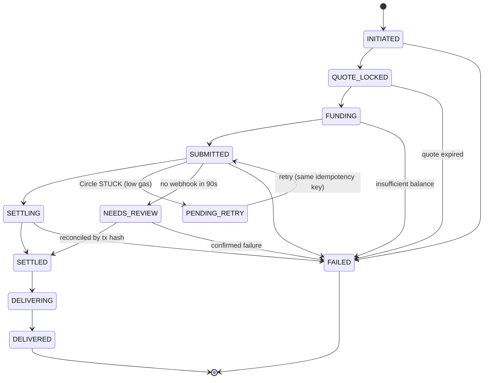

# Phase 1 Data Model — UAE → Global Cross-Border Payments on Arc

**Feature**: `001-uae-global-remittance` | **Date**: 2026-08-05
**Database**: Supabase (Postgres) · migrations under `supabase/migrations/`

---

## Design rules (non-negotiable)

1. **All money is `bigint` in USDC minor units (6 decimals).** No `float`, `real`, or
   `double precision` anywhere near money. `numeric` appears only for FX rates, which are
   ratios, not amounts.
2. **Chain ID is enforced by the database**, not just by application code —
   `CHECK (chain_id = 5042002)` (Constitution I).
3. **Status is an append-only log.** `status_events` has no `UPDATE` or `DELETE` policy.
   A transfer's status is its latest event (FR-015).
4. **Idempotency is a `UNIQUE` constraint**, not a code convention (FR-014).
5. **RLS on every user-owned table.** The public claim view is the single deliberate
   exception, and it is reachable only via an unguessable token.

---

## Enumerated types

```sql
create type account_type   as enum ('personal', 'business');
create type wallet_owner   as enum ('user', 'recipient', 'treasury');
create type transfer_state as enum (
  'INITIATED', 'QUOTE_LOCKED', 'FUNDING', 'SUBMITTED', 'SETTLING',
  'SETTLED', 'DELIVERING', 'DELIVERED',
  'FAILED', 'PENDING_RETRY', 'NEEDS_REVIEW'
);
create type run_state      as enum ('DRAFT', 'EXECUTING', 'COMPLETED', 'PARTIALLY_FAILED');
```

`transfer_state` mirrors spec §7.5 exactly. Terminal states: `DELIVERED`, `FAILED`.

---

## Tables

### `users`

| Column | Type | Constraints |
|--------|------|-------------|
| `id` | `uuid` | PK, references `auth.users(id)` |
| `email` | `text` | NOT NULL, UNIQUE |
| `display_name` | `text` | |
| `account_type` | `account_type` | NOT NULL, default `'personal'` |
| `created_at` | `timestamptz` | NOT NULL, default `now()` |

### `wallets`

| Column | Type | Constraints |
|--------|------|-------------|
| `id` | `uuid` | PK, default `gen_random_uuid()` |
| `circle_wallet_id` | `text` | NOT NULL, UNIQUE |
| `address` | `text` | NOT NULL |
| `chain_id` | `integer` | NOT NULL, **`CHECK (chain_id = 5042002)`** |
| `owner_type` | `wallet_owner` | NOT NULL |
| `user_id` | `uuid` | FK → `users(id)`, nullable |
| `recipient_id` | `uuid` | FK → `recipients(id)`, nullable |
| `created_at` | `timestamptz` | NOT NULL, default `now()` |

```sql
constraint wallet_owner_exclusive check (
  (owner_type = 'user'      and user_id is not null and recipient_id is null) or
  (owner_type = 'recipient' and recipient_id is not null and user_id is null) or
  (owner_type = 'treasury'  and user_id is null and recipient_id is null)
)
```

> The `chain_id` check is Constitution Principle I expressed as a database constraint.
> Even a catastrophic application bug cannot persist a non-Arc wallet.

### `recipients`

| Column | Type | Constraints |
|--------|------|-------------|
| `id` | `uuid` | PK |
| `user_id` | `uuid` | NOT NULL, FK → `users(id)` ON DELETE CASCADE |
| `name` | `text` | NOT NULL |
| `country` | `text` | NOT NULL, ISO-3166 alpha-2 |
| `delivery_currency` | `text` | NOT NULL, ISO-4217 (`INR`, `PKR`, `PHP`, `EGP`, `BDT`) |
| `contact_handle` | `text` | for the claim link |
| `destination_chain_id` | `integer` | nullable — non-null ⇒ cross-chain (US3) |
| `claim_token` | `text` | NOT NULL, UNIQUE, ≥32 bytes of entropy |
| `invoice_ref` | `text` | nullable — US2 reconciliation |
| `created_at` | `timestamptz` | NOT NULL, default `now()` |

`create unique index on recipients (user_id, lower(name), country);` — backs the
duplicate-merge prompt (FR-006).

### `fx_rates`

| Column | Type | Constraints |
|--------|------|-------------|
| `id` | `uuid` | PK |
| `base` | `text` | NOT NULL (`AED`) |
| `quote` | `text` | NOT NULL (`INR`…) |
| `rate` | `numeric(20,10)` | NOT NULL — a ratio, not money |
| `source` | `text` | NOT NULL — displayed to the user (NFR-007) |
| `retrieved_at` | `timestamptz` | NOT NULL |
| `is_stale` | `boolean` | NOT NULL, default `false` |

### `quotes`

| Column | Type | Constraints |
|--------|------|-------------|
| `id` | `uuid` | PK |
| `user_id` | `uuid` | NOT NULL, FK → `users(id)` |
| `recipient_id` | `uuid` | NOT NULL, FK → `recipients(id)` |
| `send_aed` | `bigint` | NOT NULL — AED fils (2dp) |
| `send_usdc6` | `bigint` | NOT NULL, `CHECK (> 0)` |
| `network_fee_usdc6` | `bigint` | NOT NULL, `CHECK (>= 0)` |
| `service_fee_usdc6` | `bigint` | NOT NULL, `CHECK (>= 0)` |
| `fx_spread_bps` | `integer` | NOT NULL, default `0` — shown even at zero (FR-011) |
| `fx_rate_id` | `uuid` | NOT NULL, FK → `fx_rates(id)` |
| `landed_amount_minor` | `bigint` | NOT NULL — destination currency, **simulated** |
| `landed_currency` | `text` | NOT NULL |
| `eta_seconds` | `integer` | NOT NULL |
| `expires_at` | `timestamptz` | NOT NULL |
| `created_at` | `timestamptz` | NOT NULL, default `now()` |

> Every field the §7.4 disclosure panel must render is **persisted on the quote**. The
> panel is a pure projection of this row — it cannot display a number the system did not
> commit to. That is what makes FR-008 auditable after the fact.

### `transfers`

| Column | Type | Constraints |
|--------|------|-------------|
| `id` | `uuid` | PK |
| `user_id` | `uuid` | NOT NULL, FK → `users(id)` |
| `recipient_id` | `uuid` | NOT NULL, FK → `recipients(id)` |
| `quote_id` | `uuid` | NOT NULL, FK → `quotes(id)` |
| `payout_run_id` | `uuid` | nullable, FK → `payout_runs(id)` |
| `amount_usdc6` | `bigint` | NOT NULL, `CHECK (> 0)` |
| `idempotency_key` | `text` | NOT NULL |
| `circle_transaction_id` | `text` | nullable, UNIQUE |
| `tx_hash` | `text` | nullable |
| `explorer_url` | `text` | nullable |
| `bridge_tx_hash` | `text` | nullable — US3 leg 2 |
| `created_at` | `timestamptz` | NOT NULL, default `now()` |
| `delivered_at` | `timestamptz` | nullable |

```sql
create unique index transfers_idem on transfers (user_id, idempotency_key);
```

> This index **is** FR-014. A duplicate submission cannot create a second row, regardless
> of what the application layer does.

### `status_events` — append-only

| Column | Type | Constraints |
|--------|------|-------------|
| `id` | `uuid` | PK |
| `transfer_id` | `uuid` | NOT NULL, FK → `transfers(id)` ON DELETE CASCADE |
| `from_state` | `transfer_state` | nullable (null on first event) |
| `to_state` | `transfer_state` | NOT NULL |
| `occurred_at` | `timestamptz` | NOT NULL, default `now()` |
| `reason` | `text` | nullable — **required when `to_state = 'FAILED'`** |
| `correlation_id` | `text` | NOT NULL |

```sql
constraint failure_needs_reason check (to_state <> 'FAILED' or reason is not null)
```

> FR-019 ("every terminal failure carries a plain-language reason") is a database
> constraint. A failure without an explanation is not representable.

Current status view:

```sql
create view transfer_current_status as
select distinct on (transfer_id) transfer_id, to_state as state, occurred_at, reason
from status_events order by transfer_id, occurred_at desc, id desc;
```

### `payout_runs`

| Column | Type | Constraints |
|--------|------|-------------|
| `id` | `uuid` | PK |
| `user_id` | `uuid` | NOT NULL, FK → `users(id)` |
| `total_usdc6` | `bigint` | NOT NULL |
| `total_fee_usdc6` | `bigint` | NOT NULL |
| `state` | `run_state` | NOT NULL, default `'DRAFT'` |
| `idempotency_key` | `text` | NOT NULL |
| `created_at` | `timestamptz` | NOT NULL, default `now()` |

`PARTIALLY_FAILED` is a first-class terminal state, not an error — E11 requires that
successful items stand when a sibling fails.

### `treasury_balances`

| Column | Type | Constraints |
|--------|------|-------------|
| `id` | `uuid` | PK |
| `unified_usdc6` | `bigint` | NOT NULL |
| `per_chain` | `jsonb` | NOT NULL — `[{ "domain": 26, "chain": "ARC-TESTNET", "usdc6": "123456" }]` |
| `observed_at` | `timestamptz` | NOT NULL, default `now()` |

Snapshot table, cached ~30 s (R4). `per_chain` amounts are strings in JSON to survive
JavaScript's `Number.MAX_SAFE_INTEGER`.

---

## Row Level Security

```sql
alter table users, wallets, recipients, quotes, transfers, status_events,
             payout_runs enable row level security;

create policy own_rows on recipients
  for all using (user_id = auth.uid());
-- equivalent policies on quotes, transfers, payout_runs

create policy own_wallets on wallets
  for select using (
    user_id = auth.uid()
    or recipient_id in (select id from recipients where user_id = auth.uid())
  );

create policy own_events on status_events
  for select using (
    transfer_id in (select id from transfers where user_id = auth.uid())
  );
-- deliberately NO insert/update/delete policy: writes go through the service role only
```

**Claim view exception**: `/api/claim/:token` runs server-side with the service role,
looks the recipient up by `claim_token`, and returns a **minimal projection** — sender
first name, landed amount, currency, delivered timestamp. It never returns wallet
addresses, emails, transfer ids, or any other recipient's data.

**Treasury**: `treasury_balances` has no RLS policy for end users. It is read only through
the server-side `/api/treasury` route.

---

## State machine



**Invariants**

- Every transition appends a `status_event`; none mutates an existing row.
- `NEEDS_REVIEW` **never** leads to a resubmission — only to reconciliation by transaction
  hash (E6, NFR-023).
- `PENDING_RETRY` reuses the **same** idempotency key, so a retry cannot double-spend.
- `FAILED` always carries a `reason` — enforced by `failure_needs_reason`.

---

## Validation rules (application layer, from spec requirements)

| Rule | Source |
|------|--------|
| `send_aed` between 1.00 and `DEMO_MAX_SEND_AED` | R2, E10 |
| Quote must be unexpired at execution | FR-010, E3 |
| Sender balance ≥ `amount + fees` before submission | E1 |
| `assertArcTestnet(5042002)` before any wallet call | FR-013, E8 |
| `Idempotency-Key` header required on transfer creation | FR-014 |
| All amounts parsed as `bigint`; `number` rejected at the boundary | FR-018, R4 |
| Server-side validation of amount, recipient, currency | NFR-014 |
