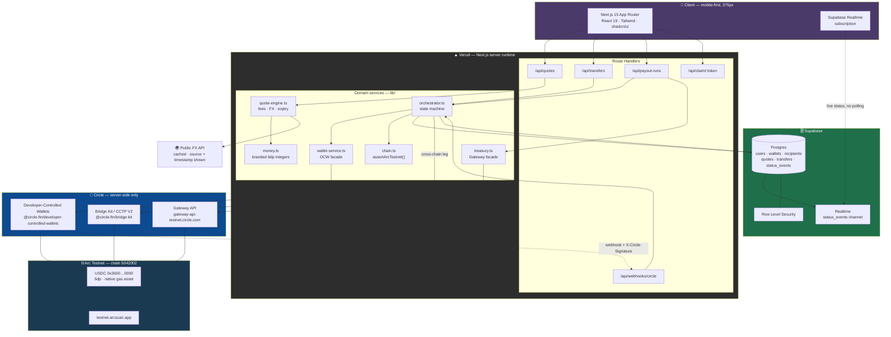
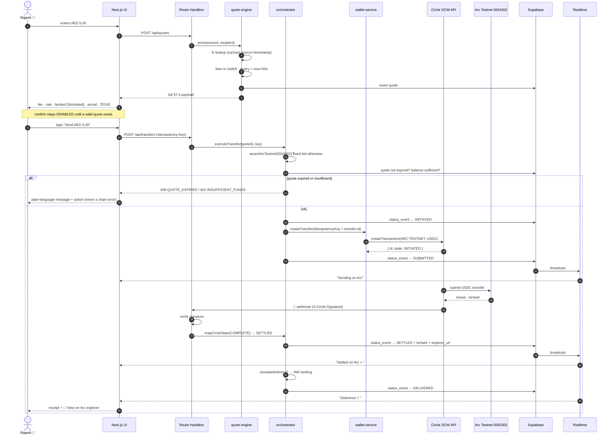
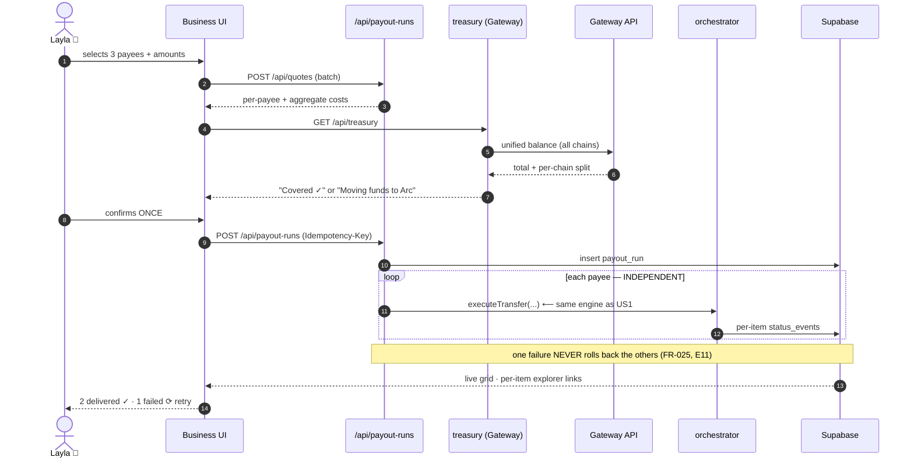
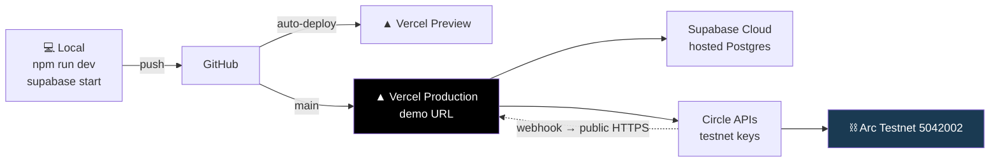

# Implementation Plan: UAE → Global Cross-Border Payments on Arc

**Branch**: `001-uae-global-remittance` | **Date**: 2026-08-05 | **Spec**: [spec.md](./spec.md)
**Input**: Feature specification from `specs/001-uae-global-remittance/spec.md`
**Governing authority**: `.specify/memory/constitution.md` v1.0.0
**Sprint window**: 2026-08-05 → 2026-08-10 (5 days)

---

## Summary

Fork **`circlefin/arc-commerce`** (Next.js + Supabase + Circle Developer-Controlled
Wallets, Apache-2.0, already wired for `ARC-TESTNET` with webhook signature verification)
and reshape its credit-purchase flow into a **transparent UAE → Global remittance rail**.

The hero path: sender signs in → picks a recipient → sees a fully itemised quote →
confirms once → watches a real USDC transfer settle on Arc Testnet in seconds via a live
status timeline → gets a receipt with a public explorer link.

Four Circle products do real work: **USDC on Arc** (settlement), **Developer-Controlled
Wallets** (seedless custody), **Gateway** (unified treasury balance), and **Bridge Kit /
CCTP V2** (cross-chain delivery).

> ### 🔄 Phase 0 reversed a risk recorded in the spec
>
> Spec §6.4 recorded **R1 (HIGH)**: "the Bridge SDK does not accept Arc Testnet as a
> routing source or destination", sourced from third-party reporting. **Circle's own
> skills repository contradicts this.** `circlefin/skills → bridge-stablecoin` states
> Bridge Kit supports bridging "between any two chains on Circle Wallets" and lists
> **Arc Testnet as supported**, with a first-party `@circle-fin/adapter-circle-wallets`
> adapter that pairs directly with our DCW setup.
>
> **Consequence**: CCTP via **Bridge Kit** is viable and cheap. R1 drops **HIGH → LOW**.
> The Q2 decision (Gateway-first) still stands as the safe default, but User Story 3 is
> now likely to ship rather than be dropped. Still to be confirmed hands-on by the D0 spike.

---

## Technical Context

**Language/Version**: TypeScript 5.x (`strict`), Node.js **v22+** (arc-commerce `.nvmrc`)
**Framework**: Next.js 15 (App Router), React 19
**Primary Dependencies**: `@circle-fin/developer-controlled-wallets`, `@circle-fin/bridge-kit`,
`@circle-fin/adapter-circle-wallets`, `viem` (native `arcTestnet` chain), `@supabase/supabase-js`,
`zod`, `tailwindcss`, `shadcn/ui`
**Storage**: Supabase (Postgres) with committed migrations + Supabase Realtime for live status
**Testing**: Vitest (unit — money, fees, state machine), Playwright (one E2E hero-path smoke)
**Target Platform**: Vercel (web), Arc Testnet chain **5042002**
**Project Type**: Web application (Next.js full-stack — frontend + Route Handlers as backend)
**Performance Goals**: quote < 500 ms (NFR-002); confirm→delivered < 15 s (NFR-001);
status propagation < 2 s (NFR-004); FCP < 2.5 s on 4G (NFR-003)
**Constraints**: 375px mobile-first; zero crypto vocabulary on default path; faucet
~1 USDC/address/day; all Circle calls server-side only
**Scale/Scope**: Demo-grade — ~20 seeded users, hundreds of transfers. No HA, no
autoscaling, no load testing.

### Verified environment facts (Phase 0 — all first-party sourced)

| Fact | Value | Source |
|------|-------|--------|
| Arc Testnet chain ID | **5042002** (`0x4CEF52`) | `circlefin/skills → use-arc` |
| Arc RPC / WSS | `https://rpc.testnet.arc.network` / `wss://rpc.testnet.arc.network` | same |
| Arc explorer | `https://testnet.arcscan.app` | same |
| **USDC contract on Arc** | `0x3600000000000000000000000000000000000000` | same |
| EURC contract on Arc | `0x89B50855Aa3bE2F677cD6303Cec089B5F319D72a` | same |
| Arc CCTP domain | **26** | same |
| viem support | **native** — `import { arcTestnet } from 'viem/chains'` | same |
| Gateway API (testnet) | `https://gateway-api-testnet.circle.com/v1/` | `use-gateway` |
| Gateway Wallet (EVM testnet) | `0x0077777d7EBA4688BDeF3E311b846F25870A19B9` | same |
| Gateway Minter (EVM testnet) | `0x0022222ABE238Cc2C7Bb1f21003F0a260052475B` | same |
| Gateway testnet chains | all mainnet chains **+ Arc Testnet (26)** | same |
| Gateway speed | **< 500 ms** cross-chain availability | same |
| DCW package | `@circle-fin/developer-controlled-wallets` | `use-developer-controlled-wallets` |
| DCW Arc support | **`ARC-TESTNET` confirmed supported** | same + `arc-commerce/.env.example` |
| DCW idempotency | **UUID v4 `idempotencyKey` on every mutation** | same |
| Bridge Kit | `@circle-fin/bridge-kit` + `@circle-fin/adapter-circle-wallets` | `bridge-stablecoin` |
| Bridge Kit speed | Fast **~8–20 s** (default) · Standard ~15–19 min | same |
| Base repo | `circlefin/arc-commerce`, branch **`master`**, **Apache-2.0**, Node 22+ | GitHub |

### ⚠️ The most dangerous technical detail in this build: Arc's dual-interface gas model

Arc exposes **one pool of funds through two interfaces**:

- **Native view** — **18 decimals**, used for gas and `msg.value`
- **ERC-20 view** — **6 decimals**, used for balances, transfers, approvals, display
- Conversion: `1e18 native = 1e6 ERC-20`
- Circle's explicit rule: **never sum both views or treat them as separate assets.**

**Mitigation, enforced in code** (`lib/money.ts`): the application works **exclusively in
the 6-decimal ERC-20 view**. The 18-decimal native view is touched in exactly one place —
reading observed gas cost for fee display — and converted immediately. Branded TypeScript
types make the two physically unassignable.

This is the highest-probability source of a silent 10¹²× money bug in the whole project.

---

## Constitution Check

*GATE: Must pass before Phase 0 research. Re-checked after Phase 1 design.*

| # | Gate | Pre-P0 | Post-P1 | How this plan satisfies it |
|---|------|:---:|:---:|---|
| 1 | Chain 5042002 with hard assertion | ✅ | ✅ | `lib/chain.ts` single constant + `assertArcTestnet()` in every wallet-touching server action; DB `CHECK` constraint; startup env validation |
| 2 | Hero path real, simulated labelled | ✅ | ✅ | Real DCW transfer on Arc; only the INR landing is simulated, rendered solely via `<SimulatedBadge>` |
| 3 | Fee/rate/arrival/status all pre-confirm | ✅ | ✅ | `POST /api/quotes` returns the complete §7.4 payload; confirm disabled until a non-expired quote id exists |
| 4 | 375px, zero crypto vocabulary | ✅ | ✅ | Mobile-first Tailwind; `scripts/check-copy.ts` fails CI on banned terms |
| 5 | 4+ Circle products doing real work | ✅ | ✅ | USDC/Arc · DCW · Gateway · Bridge Kit — mapped in §5 and the README |
| 6 | Extend official sample, record provenance | ✅ | ✅ | Fork `arc-commerce@master`; `docs/PROVENANCE.md` records commit + delta |
| 7 | Secrets server-side, `.env.example` synced | ✅ | ✅ | `lib/env.ts` zod-validated; ESLint bans Circle SDK imports outside 3 modules; CI secret grep |
| 8 | Judge-runnable in 10 minutes | ✅ | ✅ | `npm run demo:seed`; README written D3, verified from clean clone D5 |
| 9 | Hero path demoable at every commit | ✅ | ✅ | Vertical slices; D2 ends with a working hero path; every later day is additive |

**Result: PASS — no violations.** Complexity Tracking is empty.

### One deviation from the spec, flagged rather than applied silently

Spec Assumption 4 permits "AED 100 in copy maps to a sub-USDC on-chain amount" — i.e. a
**display scale factor**. This plan **rejects that** in favour of **honest 1:1 amounts at
small denominations** (sends of AED 1–20, capped by `DEMO_MAX_SEND_AED`).

**Rationale**: a hidden scale factor means the number on screen is not the number on
chain. That is precisely the quiet dishonesty Constitution II exists to prevent, and a
judge comparing the UI against the explorer would find it in seconds. Small real amounts
cost a little demo drama and buy total verifiability. I've planned for this, but it
amends the spec, so it needs your acknowledgement.

---

## 1. High-Level System Architecture



### The three architectural bets

1. **Webhooks, not polling.** `arc-commerce` already implements Circle webhook signature
   verification. Circle pushes terminal transaction state → we append a `status_event` →
   Supabase Realtime pushes to the browser. Satisfies FR-016 and NFR-004 with **zero
   polling loops**, reusing inherited code.
2. **The database is the source of truth for status — never the chain.** Status is an
   append-only `status_events` log (FR-015). We never re-derive status by querying Arc at
   render time. Fast, replayable, and honest about what we knew when.
3. **One orchestrator, two surfaces.** User Story 2 (batch) is a loop over the same
   `orchestrator.executeTransfer()` as User Story 1, not a second pipeline. This is what
   makes the second hero cost UI time rather than architecture time (Constitution IX).

---

## 2. Component Breakdown

### 2.1 Frontend (`app/`, `components/`)

| Component | Responsibility | Requirements |
|-----------|---------------|--------------|
| `app/(auth)/` | Email + OTP via Supabase Auth | FR-001 |
| `app/send/` | Amount entry, `<QuotePanel>`, review, confirm | FR-008–011, §7.4 |
| `app/transfers/[id]/` | Live `<StatusTimeline>` + receipt | FR-016, FR-017, FR-020 |
| `app/recipients/` | CRUD + duplicate-merge prompt | FR-005–007 |
| `app/business/` | Payee list, batch composer, `<TreasuryPanel>` | FR-023–026 |
| `app/claim/[token]/` | Public recipient view — **no auth, no install** | FR-021–022 |
| `components/QuotePanel` | Renders §7.4 verbatim; owns expiry countdown | FR-008, FR-010 |
| `components/SimulatedBadge` | The **only** way to render a simulated value | FR-012, NFR-008 |
| `components/TestnetBanner` | Persistent, in root layout, non-dismissible | FR-027 |
| `components/TechnicalDetails` | Collapsed `<details>`; sole home of addresses/hashes | FR-003, NFR-017 |

**Rule**: no component formats money itself. All formatting routes through `lib/money.ts`,
so the 6dp invariant cannot be bypassed at the view layer.

### 2.2 Backend APIs (`app/api/`)

| Endpoint | Method | Purpose | Notes |
|----------|--------|---------|-------|
| `/api/quotes` | POST | Price a transfer; full §7.4 payload + 60 s expiry | No on-chain side effects |
| `/api/transfers` | POST | Execute against a valid quote | **Requires `Idempotency-Key`** (FR-014) |
| `/api/transfers/:id` | GET | Transfer + ordered status events | Realtime primary; this is fallback |
| `/api/payout-runs` | POST | Create + execute a batch | Fans out to per-item transfers |
| `/api/treasury` | GET | Gateway unified balance + per-chain split | Cached 30 s (R4) |
| `/api/webhooks/circle` | POST | Circle transaction notifications | **Signature-verified**; inherited |
| `/api/claim/:token` | GET | Public recipient view | Unguessable token; no auth; minimal PII |

All handlers: zod-validated input (NFR-014), authenticated + ownership-checked (NFR-013),
`{ code, message, correlationId }` on error (NFR-025).

### 2.3 Wallet Service (`lib/wallet-service.ts`)

Thin facade over `@circle-fin/developer-controlled-wallets`. **The only module permitted
to import the Circle wallets SDK.**

```typescript
initiateDeveloperControlledWalletsClient({
  apiKey: env.CIRCLE_API_KEY,             // format PREFIX:ID:SECRET
  entitySecret: env.CIRCLE_ENTITY_SECRET, // 32-byte hex, registered once
})
```

- **Account type: EOA**, not SCA. On Arc, USDC *is* the gas asset, so an EOA holding USDC
  funds its own gas — no Gas Station, no ERC-4337 complexity, no creation fee. SCA's
  advantages (sponsorship, batching) don't pay for themselves in a 5-day build.
- **One wallet set** → same address across EVM chains, simplifying the Gateway story.
- Operations: `ensureWalletForUser`, `getUsdcBalance`, `createTransfer`, `getTransaction`.
- **Gotcha encoded**: Circle's docs explicitly say *do not* use `getWallet`/`getWallets`
  for balances — this service uses the dedicated balance endpoint.
- Every mutation passes a **UUID v4 `idempotencyKey`** derived from our transfer id, so
  FR-014 and Circle's exactly-once guarantee are the *same* key.

### 2.4 Payment Orchestration (`lib/orchestrator.ts`)

Owns the transfer lifecycle. Pure state transitions; all I/O injected.

```
validateQuote → assertArcTestnet → debitCheck → persist(INITIATED)
  → wallet.createTransfer(idempotencyKey)
  → persist(SUBMITTED)  ── webhook ──▶ mapCircleState() → persist(SETTLED|FAILED)
  → simulateDelivery()  → persist(DELIVERED)
```

**Circle → our state mapping** (from the verified DCW lifecycle):

| Circle state | Our state | User sees |
|---|---|---|
| `INITIATED` / `QUEUED` / `CLEARED` | `SUBMITTED` | Sending on Arc |
| `SENT` | `SETTLING` | Confirming on Arc |
| `CONFIRMED` / `COMPLETE` | `SETTLED` | Settled on Arc ✓ |
| `FAILED` / `DENIED` / `CANCELLED` | `FAILED` | Couldn't complete — *reason* |
| `STUCK` | `PENDING_RETRY` | Taking longer than usual |
| *(no webhook in 90 s)* | `NEEDS_REVIEW` | We're checking on this |

`STUCK` means low fees — on Arc that means low USDC for gas, a real and likely condition
given the faucet limit. It maps to a retry state, **never** a resubmission (E6, NFR-023).

### 2.5 Status Tracking (`lib/status.ts` + Supabase Realtime)

- `status_events` is **append-only**. Current status = latest event. There is no mutable
  `status` column that can drift from its own history.
- Client subscribes to `status_events` filtered by `transfer_id`. No polling.
- A `NEEDS_REVIEW` sweeper resolves stragglers by transaction hash — it reconciles, it
  never resubmits.

### 2.6 Database (Supabase Postgres)

Migrations committed under `supabase/migrations/` (never console-edited). RLS on every
user-owned table. Full DDL in [`data-model.md`](./data-model.md).

### 2.7 Money (`lib/money.ts`) — the safety-critical module

```typescript
declare const brand: unique symbol
export type Usdc6    = bigint & { readonly [brand]: 'Usdc6' }    // ERC-20 view, 6dp
export type Native18 = bigint & { readonly [brand]: 'Native18' } // gas view, 18dp

export const nativeToUsdc6 = (n: Native18): Usdc6 =>
  (n / 1_000_000_000_000n) as Usdc6
```

Branding makes `Usdc6` and `Native18` **physically unassignable**, so Arc's dual-interface
trap becomes a compile error rather than a 10¹²× production bug. `number` is never used
for money anywhere (FR-018).

---

## 3. Key Data Models

Full DDL, constraints, and RLS policies in [`data-model.md`](./data-model.md).

```mermaid
erDiagram
    USERS ||--o| WALLETS : owns
    USERS ||--o{ RECIPIENTS : saves
    USERS ||--o{ TRANSFERS : sends
    USERS ||--o{ PAYOUT_RUNS : creates
    RECIPIENTS ||--o| WALLETS : "receives into"
    RECIPIENTS ||--o{ TRANSFERS : receives
    QUOTES ||--o| TRANSFERS : prices
    TRANSFERS ||--o{ STATUS_EVENTS : "logs (append-only)"
    PAYOUT_RUNS ||--o{ TRANSFERS : "fans out to"
    FX_RATES ||--o{ QUOTES : "sourced by"

    USERS { uuid id PK; text email UK; text account_type }
    WALLETS { uuid id PK; text circle_wallet_id UK; text address; int chain_id "CHECK = 5042002" }
    RECIPIENTS { uuid id PK; text name; text country; text delivery_currency; text claim_token UK }
    QUOTES { uuid id PK; bigint send_usdc6; bigint network_fee_usdc6; bigint service_fee_usdc6; numeric fx_rate; text fx_source; timestamptz fx_at; timestamptz expires_at }
    TRANSFERS { uuid id PK; bigint amount_usdc6; text idempotency_key UK; text tx_hash; text explorer_url }
    STATUS_EVENTS { uuid id PK; text from_state; text to_state; timestamptz occurred_at; text reason; text correlation_id }
    PAYOUT_RUNS { uuid id PK; bigint total_usdc6; text status }
    FX_RATES { text base; text quote; numeric rate; text source; bool is_stale }
```

**Enforced invariants**

- `wallets.chain_id` has `CHECK (chain_id = 5042002)` — Constitution I enforced **in the
  database**, not merely in application code.
- All money columns are `bigint` minor units. No `float`/`real` for money. (`numeric` is
  used only for FX rates, which are ratios, not money.)
- `transfers.idempotency_key` is `UNIQUE` per user — FR-014 guaranteed by a constraint.
- `status_events` has no `UPDATE`/`DELETE` policy. Append-only by construction.

---

## 4. Sequence Diagrams

### 4.1 Hero flow — quote → confirm → settle → deliver (User Story 1)



### 4.2 Batch payout with Gateway treasury check (User Story 2)



### 4.3 Cross-chain delivery via Bridge Kit (User Story 3 — P3, droppable)

```mermaid
sequenceDiagram
    autonumber
    participant O as orchestrator
    participant BK as "@circle-fin/bridge-kit"
    participant AD as adapter-circle-wallets
    participant A as Arc Testnet (domain 26)
    participant B as Base Sepolia
    participant DB as Supabase

    O->>BK: bridge(from: Arc, to: Base, amount)
    BK->>AD: sign via Circle DCW
    AD->>A: approve → burn
    A-->>BK: burn txHash
    O->>DB: status_event → SETTLED (leg 1) + Arc explorer link
    BK->>BK: fetchAttestation (Fast ≈8–20s, useForwarder)
    BK->>B: mint
    B-->>BK: mint txHash
    O->>DB: status_event → DELIVERED (leg 2) + Base explorer link
    Note over O,DB: sender sees ONE total cost; both legs linkable on expand
```

---

## 5. Exact Circle SDK / API Integration Points

| # | Circle product | Package / endpoint | Called from | Serves |
|---|---|---|---|---|
| 1 | **USDC on Arc** | contract `0x3600…0000`, 6dp, chain 5042002, native gas asset | `lib/chain.ts`, `lib/money.ts` | Every transfer · FR-013, FR-018 |
| 2 | **Developer-Controlled Wallets** | `@circle-fin/developer-controlled-wallets` → `initiateDeveloperControlledWalletsClient` | `lib/wallet-service.ts` **only** | FR-002–004, FR-014 |
| — | ↳ `createWalletSet` | one set; shared address across EVM | bootstrap script | Gateway simplification |
| — | ↳ `createWallets({ blockchains: ['ARC-TESTNET'], accountType: 'EOA' })` | signup + recipient creation | FR-002 |
| — | ↳ `createTransaction({ idempotencyKey, tokenId, amount, destinationAddress })` | `orchestrator.executeTransfer` | FR-013, FR-014 |
| — | ↳ balance endpoint (**not** `getWallet`) | `getUsdcBalance` | FR-004 |
| — | ↳ **webhooks** + `X-Circle-Signature` | `/api/webhooks/circle` | FR-015, FR-016, NFR-004 |
| 3 | **Gateway** | `https://gateway-api-testnet.circle.com/v1/`; Wallet `0x0077777d…19B9`, Minter `0x0022222A…475B` | `lib/treasury.ts` | FR-026 · unified balance |
| 4 | **Bridge Kit / CCTP V2** | `@circle-fin/bridge-kit` + `@circle-fin/adapter-circle-wallets`; Arc domain **26**; Fast ≈8–20 s, `useForwarder: true` | `lib/bridge.ts` | FR-031 (US3) |
| 5 | *StableFX (optional)* | not integrated — **labelled simulated adapter** behind a real-shaped interface | `lib/fx/stablefx-simulated.ts` | FR-039 |

**Structural enforcement**: only `lib/wallet-service.ts`, `lib/treasury.ts`, and
`lib/bridge.ts` may import a Circle SDK. An ESLint `no-restricted-imports` rule fails the
build anywhere else — which is how NFR-011 is guaranteed structurally rather than by
discipline.

---

## 6. Environment Variables & Secrets Management

`lib/env.ts` parses `process.env` through a **zod schema at startup** and throws naming
the missing variable (FR-028). Nothing else reads `process.env` directly.

```bash
# ── Supabase ────────────────────────────────────────────────────────────
NEXT_PUBLIC_SUPABASE_URL=https://<project>.supabase.co
NEXT_PUBLIC_SUPABASE_PUBLISHABLE_OR_ANON_KEY=<anon-key>   # public by design
SUPABASE_SECRET_KEY=<service-role-key>                     # 🔒 SERVER ONLY

# ── Circle ──────────────────────────────────────────────────────────────
CIRCLE_API_KEY=TEST_API_KEY:<id>:<secret>                  # 🔒 SERVER ONLY
CIRCLE_ENTITY_SECRET=<32-byte-hex>                         # 🔒 SERVER ONLY — register once
CIRCLE_WALLET_SET_ID=<uuid>                                # created by bootstrap
CIRCLE_BLOCKCHAIN=ARC-TESTNET                              # must equal ARC-TESTNET
CIRCLE_USDC_TOKEN_ID=<token-uuid>                          # from Circle console
CIRCLE_WEBHOOK_PUBLIC_KEY_ID=<key-id>                      # signature verification

# ── Arc Testnet ─────────────────────────────────────────────────────────
NEXT_PUBLIC_ARC_CHAIN_ID=5042002                           # public: display + guard
NEXT_PUBLIC_ARC_EXPLORER_URL=https://testnet.arcscan.app   # public: receipt links
ARC_RPC_URL=https://rpc.testnet.arc.network

# ── Gateway / Bridge ────────────────────────────────────────────────────
GATEWAY_API_URL=https://gateway-api-testnet.circle.com/v1
GATEWAY_WALLET_ADDRESS=0x0077777d7EBA4688BDeF3E311b846F25870A19B9
GATEWAY_MINTER_ADDRESS=0x0022222ABE238Cc2C7Bb1f21003F0a260052475B

# ── FX & demo policy ────────────────────────────────────────────────────
FX_API_URL=<public-rate-endpoint>
FX_API_KEY=<optional>                                      # 🔒 SERVER ONLY
AED_USD_PEG=3.6725
SERVICE_FEE_AED=0.99
QUOTE_TTL_SECONDS=60
DEMO_MAX_SEND_AED=20                                        # faucet guard (R2)
TREASURY_LOW_BALANCE_USDC=0.50                              # triggers demo banner
```

### Secret rules — non-negotiable (Constitution VII)

1. **Only four variables may be `NEXT_PUBLIC_`**: the Supabase URL, the Supabase anon key,
   and the two Arc display constants. **No Circle value is ever `NEXT_PUBLIC_`.**
2. `.gitignore` from the first commit: `.env*` (except `.env.example`), `*.pem`,
   `*-recovery-file.json` — the recovery file is Circle's own explicit warning.
3. The entity-secret **recovery file is stored outside the repository**, full stop.
4. CI gate `scripts/check-secrets.sh` greps the diff for `CIRCLE_`, `sk_`, `service_role`,
   and any 32-hex-char run; fails the build on a hit.
5. Vercel: all server secrets as **Encrypted Environment Variables**, never in `vercel.json`.
6. Pre-recording checklist: secrets re-verified absent from screen, terminal scrollback,
   and browser devtools before the demo video is captured.

---

## 7. Recommended Starting Point

### Fork `circlefin/arc-commerce` (`master`, Apache-2.0)

**Why this one**: it is the only official sample already combining *every* piece of our
stack — Next.js + Supabase + Developer-Controlled Wallets on `ARC-TESTNET`, with
`CIRCLE_BLOCKCHAIN=ARC-TESTNET` in its own `.env.example` and **Circle webhook signature
verification already implemented**. Its admin/user dashboard split maps almost one-to-one
onto our business/consumer surfaces.

**Keep**: auth + Supabase wiring · DCW client setup and admin-wallet bootstrap · webhook
receiver and signature verification · migration tooling · Tailwind/shadcn baseline.

**Replace**: credit-purchase domain → remittance domain (recipients, quotes, transfers,
status events) · admin dashboard → business payout surface · product UI → mobile-first
send flow.

**Add**: `lib/money.ts` (branded 6dp), quote engine, orchestrator + state machine,
Realtime status, claim-link recipient view, Gateway treasury panel, Bridge Kit leg.

### Patterns to lift (read, don't fork)

| Repo | Take |
|------|------|
| `circlefin/arc-multichain-wallet` | Gateway unified-balance UX and deposit flow — closest thing to our treasury panel |
| `circlefin/arc-fintech` | Multi-chain treasury management + cross-chain interop patterns for US2/US3 |
| `circlefin/skills` | First-party `use-arc`, `use-gateway`, `use-developer-controlled-wallets`, `bridge-stablecoin` — the authoritative reference used throughout this plan |

**Provenance** (Constitution VI): `docs/PROVENANCE.md` records the upstream repo, exact
commit SHA, Apache-2.0 notice, and a summary of what was kept, replaced, and added.
`NOTICE` and upstream license headers preserved.

---

## 8. Deployment Plan



**Steps**

1. **Supabase Cloud** project (not local Docker) — webhooks need a reachable database, and
   judges shouldn't need Docker to run the demo.
2. `npx supabase db push` to apply committed migrations.
3. **Vercel** project linked to the repo; all secrets as Encrypted Env Vars; Node 22.
4. **Circle Console**: register the webhook endpoint at
   `https://<vercel-domain>/api/webhooks/circle`. *(Local dev uses ngrok — already
   documented in the arc-commerce README.)*
5. `npm run demo:seed` against production to create treasury, demo users, recipients.
6. **Fund the treasury** from the faucet — start day 0, repeat daily (R2).
7. Smoke-test the hero flow on the deployed URL, then verify the tx on `testnet.arcscan.app`.

**Invariants**: `main` is always demoable (NFR-024). Preview deploys per branch. Rollback
= Vercel instant rollback. A pinned, known-good deployment URL is recorded before the demo
video is captured.

---

## 9. Risks & Mitigations

| # | Risk | Sev | Mitigation | Day |
|---|------|:---:|-----------|:---:|
| ~~**R2**~~ | ~~Faucet ~1 USDC/day — demo runs dry~~ | 🟢 **LOW** ⬇ | **Corrected 2026-08-06 by measurement**: faucet gives **20 USDC per address every 2 hours**, not 1/day. One request returned 20.000000 USDC. Demo amounts need not be in cents. Still fund before recording (SC-018). | done D0 |
| **R9** | **Arc dual-interface (18dp native vs 6dp ERC-20) → 10¹²× money bug** | 🔴 **HIGH** | Branded `Usdc6`/`Native18` make the mix a **compile error**. Unit tests on every conversion. One module touches the native view. | D1 |
| **R6** | **5-day timeline overrun** | 🔴 **HIGH** | Constitution IX order is absolute. US3 + all §4.3 items droppable. D5 is buffer, not build. | all |
| R1b | Gateway load-bearing for Constitution V cross-chain | 🟠 MED | **Largely resolved in Phase 0**: Gateway confirmed on Arc Testnet (domain 26) with contract addresses. D0 spike verifies hands-on. Fallback: Bridge Kit (now low-risk). | D0 |
| R7 | `arc-commerce` diverges from current SDK versions | 🟠 MED | **D0 spike task #1**: clone, install, run, send one USDC on Arc *before* building. Pin all versions. | D0 |
| R10 | Circle webhook not delivered / misconfigured | 🟠 MED | `NEEDS_REVIEW` sweeper after 90 s reconciles by tx hash. Never resubmits (E6). Fallback poll `getTransaction`. | D2 |
| R11 | Entity-secret registration or recovery-file mishandling | 🟠 MED | Register once on D0; recovery file **outside repo**; `.gitignore` `*-recovery-file.json` from commit #1. | D0 |
| R4 | Circle API rate limits during live demo | 🟡 LOW | Cache treasury/balance reads 30 s. Never rate-limit the hero path. Pre-warm before recording. | D4 |
| R5 | FX source unavailable | 🟡 LOW | Cached last-known rate labelled **stale** with timestamp (E7). AED↔USD is a fixed peg. | D1 |
| **R1** | ~~CCTP Bridge SDK won't route Arc~~ | 🟢 **LOW** ⬇ | **Reversed in Phase 0.** Circle's own `bridge-stablecoin` skill lists Arc Testnet as supported via `@circle-fin/adapter-circle-wallets`. Confirm in D0 spike. | D0 |
| R8 | Sub-second finality not reproduced | 🟢 LOW | NFR-001 budgets 15 s. The running counter shows the honest number whatever it is. | — |

### 5-day schedule — ordered strictly by Constitution IX

| Day | Focus | Exit criterion |
|-----|-------|----------------|
| **D0** *(today, partial)* | **Spikes only, no product code.** Fork arc-commerce, install, run. Register entity secret. Create wallet set. **Send one real USDC on Arc.** Verify Gateway + Bridge Kit on Arc. Fund treasury. | ✅ A real Arc tx hash exists on `testnet.arcscan.app` |
| **D1** | Foundation: `money.ts`, `chain.ts`, `env.ts`, schema + migrations, quote engine, wallet service | ✅ Quote endpoint returns the full §7.4 payload |
| **D2** | 🎯 **Hero flow US1 end-to-end** + webhook + Realtime status + receipt | ✅ **Hero path works. From here `main` is always demoable.** |
| **D3** | Transparency polish · claim-link view · **README + architecture diagram** · mobile pass · copy check | ✅ Judge can run it from the README in <10 min |
| **D4** | US2 batch + Gateway treasury panel · **record demo video** · US3 if time | ✅ Video recorded against working flows |
| **D5** | **Buffer.** Circle Product Feedback · Definition-of-Done walk · secret scan · fund wallets · submit | ✅ All 12 DoD boxes verified |

**Hard rule**: D3's README and diagram ship *before* D4's second hero. If the schedule
slips, **User Story 2 is cut before documentation is.** That ordering is Constitution IX
and is not open for renegotiation under time pressure.

---

## Project Structure

### Documentation (this feature)

```text
specs/001-uae-global-remittance/
├── spec.md              # PRD (complete)
├── plan.md              # This file
├── research.md          # Phase 0 — all unknowns resolved
├── data-model.md        # Phase 1 — full DDL + RLS
├── quickstart.md        # Phase 1 — judge-facing 10-minute path
├── contracts/
│   └── openapi.yaml     # Phase 1 — API contracts
└── checklists/
    └── requirements.md  # 21/22 pass
```

### Source Code (repository root)

```text
app/
├── (auth)/                   # email + OTP
├── send/                     # 🎯 hero flow
├── transfers/[id]/           # live status + receipt
├── recipients/
├── business/                 # US2 batch + treasury
├── claim/[token]/            # public recipient view — no auth
└── api/
    ├── quotes/  transfers/  payout-runs/  treasury/
    ├── claim/[token]/
    └── webhooks/circle/      # signature-verified

components/
├── QuotePanel.tsx  StatusTimeline.tsx  SimulatedBadge.tsx
├── TestnetBanner.tsx  TechnicalDetails.tsx  TreasuryPanel.tsx
└── ui/                       # shadcn

lib/
├── money.ts                  # 🔒 branded Usdc6 / Native18
├── chain.ts                  # 🔒 assertArcTestnet(5042002)
├── env.ts                    # 🔒 zod startup validation
├── quote-engine.ts  orchestrator.ts  status.ts
├── wallet-service.ts         # 🔵 ONLY DCW importer
├── treasury.ts               # 🔵 ONLY Gateway importer
├── bridge.ts                 # 🔵 ONLY Bridge Kit importer
├── fx/                       # provider + stablefx-simulated
└── errors.ts                 # taxonomy + correlation ids

supabase/migrations/          # committed, never console-edited
scripts/
├── demo-seed.ts  demo-reset.ts  fund-treasury.ts
├── check-copy.ts             # NFR-017 banned-terms gate
└── check-secrets.sh          # Constitution VII gate

tests/
├── unit/                     # money · fees · fx · state machine
└── e2e/hero-flow.spec.ts     # one Playwright smoke

docs/
├── PROVENANCE.md             # Constitution VI
└── architecture.mmd
```

**Structure Decision**: Next.js full-stack single project. A separate backend service
would add deployment surface and cross-origin complexity for zero benefit at this scale,
and would work against Constitution IX's bias toward the smallest thing that keeps the
hero path demoable.

---

## Complexity Tracking

*No Constitution violations. Table intentionally empty.*

| Violation | Why Needed | Simpler Alternative Rejected Because |
|-----------|------------|-------------------------------------|
| — | — | — |

---

## Post-Design Constitution Re-Check

Re-run after Phase 1 artifacts (`research.md`, `data-model.md`, `contracts/`, `quickstart.md`):

**✅ PASS — all nine gates hold.** Three gates are now *structurally* enforced rather than
merely intended, which is a stronger position than pre-Phase-0:

- **Gate 1** enforced by a database `CHECK (chain_id = 5042002)` constraint, not only by
  application code.
- **Gate 7** enforced by an ESLint `no-restricted-imports` rule making a Circle SDK import
  outside the three permitted modules a **build failure**.
- **FR-018** enforced by branded types making the 18dp/6dp confusion a **compile error** —
  the single highest-risk defect class in this build.

One spec amendment requires your acknowledgement: **honest 1:1 small amounts instead of a
display scale factor** (see Constitution Check above).
